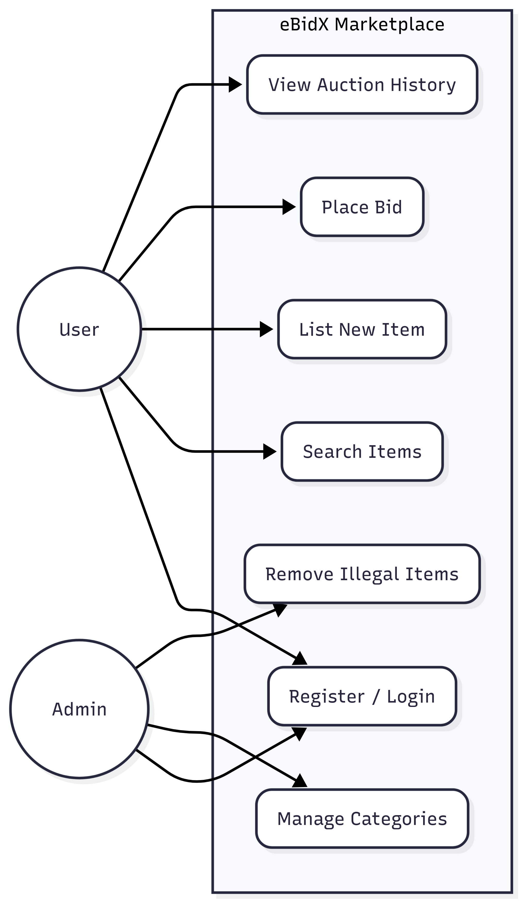
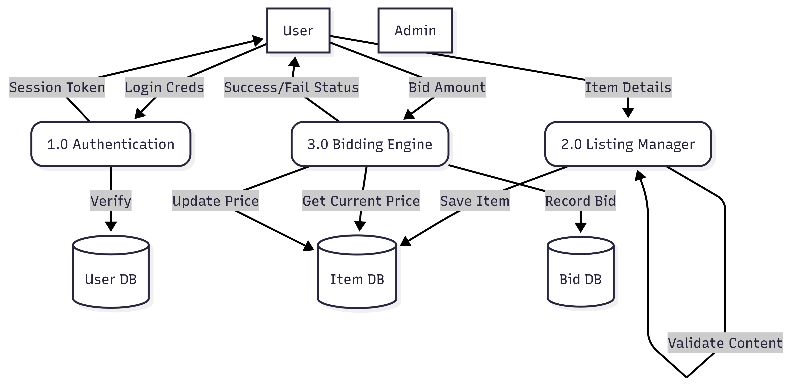
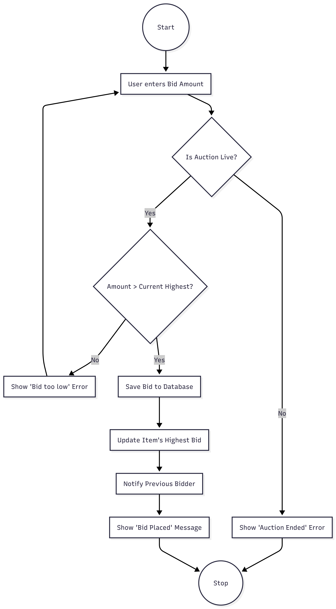
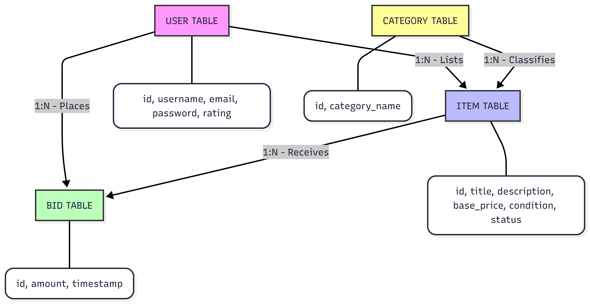
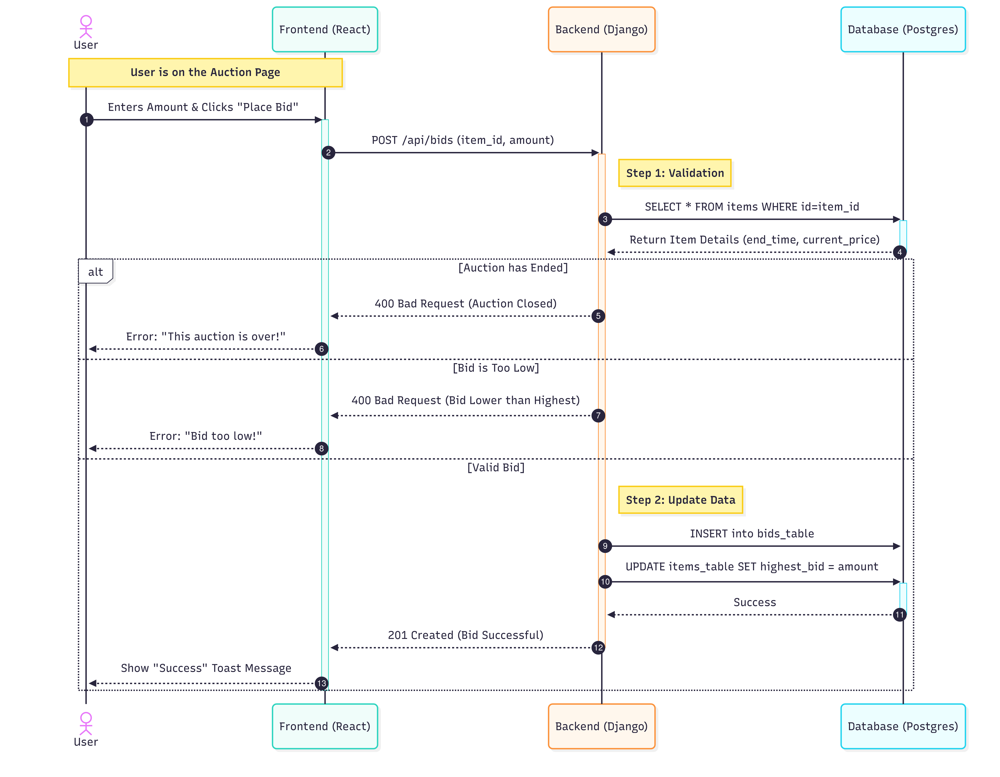

\begin{titlepage}
\thispagestyle{empty}
\flushright
\vspace{1in}
{\Large \textbf{Software Requirements Specification}}\\[1cm]
{\large for}\\[1cm]
{\Large \textbf{eBidX: Online Auction System}}\\[1cm]
Version 1.0 Approved\\[1cm]
Prepared by\\[0.5cm]
\textbf{Sreejith P V}\\
\textbf{Aswin Raju}\\
\textbf{Alen T L}\\
\textbf{Nikhil Sreekumar}\\
\textbf{Sanju M B}\\[1cm]
Department of Computer Science\\
2026-01-05
\end{titlepage}

\setcounter{page}{2}
\tableofcontents
\newpage

# Revision History

| Name     | Date       | Reason for Changes    | Version |
| :------- | :--------- | :-------------------- | :------ |
| Alen T L | 2026-01-05 | Initial draft created | 1.0     |

\newpage

# 1. Introduction

## 1.1 Purpose

The purpose of this document is to specify the Software Requirements Specification (SRS) for **eBidX**, an online auction system. The system facilitates real-time bidding on products, allowing users to list items for sale and place bids in a competitive environment. This SRS outlines the system's features, interfaces, and constraints.

## 1.2 Document Conventions

- Headings are numbered automatically.
- Key terms such as **Bidder** and **Seller** are capitalized when first introduced.
- Functional requirements are labeled as **REQ-1**, **REQ-2**, etc.
- Placeholder values are marked as **TBD**.

## 1.3 Intended Audience and Reading Suggestions

This document is intended for developers, project managers, and testers.

- **Developers:** Focus on Section 3 and Section 5.
- **Testers:** Focus on functional requirements (REQ tags).

## 1.4 Product Scope

eBidX is a web-based platform designed to support dynamic pricing through competitive bidding. It provides a secure environment for transactions and real-time bid updates.

## 1.5 References

- IEEE 29148:2018 — Systems and Software Engineering — Life Cycle Processes — Requirements Engineering
- IEEE Software Requirements Specification (SRS) Template
- Django Documentation
- React / Vite Documentation

# 2. Overall Description

## 2.1 Product Perspective

eBidX is a self-contained web application that replaces traditional offline auction processes.

- **Frontend:** React.js (SPA)
- **Backend:** Django REST Framework
- **Database:** PostgreSQL

## 2.2 Product Functions

The major system functions include:

1. **User Authentication:** Secure signup and login using JWT
2. **Auction Management:** Item listing with images and base price
3. **Real-Time Bidding:** Instant updates of highest bid
4. **Admin Controls:** User moderation and listing removal

## 2.3 User Classes and Characteristics

- **Guest:** View-only access
- **Registered User:**
  - **Seller:** Lists auction items
  - **Bidder:** Places bids frequently
- **Administrator:** Manages system and users

## 2.4 Operating Environment

- Client: Modern web browsers
- Server: Ubuntu Linux (20.04 or higher)
- Network: Stable internet connection

## 2.5 Design and Implementation Constraints

- Frontend must use React.js
- Backend must use Django
- PostgreSQL is mandatory

## 2.6 User Documentation

- Online help via "How It Works" page
- Developer documentation via repository README

## 2.7 Assumptions and Dependencies

- System clock synchronization via NTP

# 3. External Interface Requirements

## 3.1 User Interfaces

- Clean, modern responsive UI
- Persistent navigation bar

## 3.2 Hardware Interfaces

- Standard HTTP over TCP/IP

## 3.3 Software Interfaces

- RESTful APIs
- PostgreSQL database

## 3.4 Communications Interfaces

- HTTPS protocol
- JSON data format

# 4. System Features

## 4.1 Auction Listing (Seller)

### 4.1.1 Description

Registered users can create auction listings by providing product details.

### 4.1.2 Stimulus / Response Sequences

- **Stimulus:** User submits auction form
- **Response:** System validates data and creates listing

### 4.1.3 Functional Requirements

- **REQ-1:** Base price must be a positive integer
- **REQ-2:** End time must be in the future
- **REQ-3:** Image uploads must support JPG and PNG

## 4.2 Bidding Engine (Bidder)

### 4.2.1 Description

Users compete by placing bids on active auctions.

### 4.2.2 Functional Requirements

- **REQ-4:** Bid must exceed current highest bid plus increment
- **REQ-5:** Bids after end time are rejected
- **REQ-6:** Highest bid updates instantly

# 5. Other Nonfunctional Requirements

## 5.1 Performance Requirements

- Bid update latency <= 1 second
- Support at least 50 concurrent users

## 5.2 Safety Requirements

- No bids allowed on closed auctions

## 5.3 Security Requirements

- Password hashing via PBKDF2
- JWT-protected APIs
- Enforced HTTPS

## 5.4 Software Quality Attributes

- **Reliability:** 99% uptime during auctions
- **Maintainability:** Modular frontend and backend

# 6. Other Requirements

## 6.1 Requirement Traceability Matrix (RTM)

| Requirement ID | Description             | Related Use Case | System Module        |
| :------------- | :---------------------- | :--------------- | :------------------- |
| REQ-1          | Validate base price     | Create Auction   | Auction Management   |
| REQ-2          | End time must be future | Create Auction   | Auction Management   |
| REQ-3          | Image upload support    | Create Auction   | Media Service        |
| REQ-4          | Enforce bid increment   | Place Bid        | Bidding Engine       |
| REQ-5          | Reject late bids        | Place Bid        | Bidding Engine       |
| REQ-6          | Real-time bid update    | Place Bid        | Notification Service |

## 6.2 Detailed Functional Requirements

### FR-1 User Registration

- **Description:** System shall allow new users to register using email and password.
- **Inputs:** Email, Password
- **Outputs:** User account created
- **Priority:** High

### FR-2 User Login

- **Description:** System shall authenticate users and issue JWT tokens.
- **Inputs:** Credentials
- **Outputs:** Access token
- **Priority:** High

### FR-3 Create Auction

- **Description:** Seller can create auction listings with product details.
- **Inputs:** Product info, images, base price
- **Outputs:** Auction listing
- **Priority:** High

### FR-4 Place Bid

- **Description:** Bidder places a bid higher than current highest bid.
- **Inputs:** Bid amount
- **Outputs:** Updated highest bid
- **Priority:** High

### FR-5 Close Auction

- **Description:** System automatically closes auction at end time.
- **Priority:** Medium

## 6.3 Risk Analysis

| Risk                                 | Impact | Mitigation                    |
| :----------------------------------- | :----- | :---------------------------- |
| Server overload during live auctions | High   | Load balancing, caching       |
| Time synchronization issues          | Medium | NTP synchronization           |
| Fraudulent bidding                   | High   | Bid validation and monitoring |
| Network latency                      | Medium | Optimized APIs                |

## 6.4 Appendix A: Glossary

- **Bid Increment:** Minimum amount above previous bid
- **Sniper:** User bidding at last seconds

## 6.5 Appendix B: Analysis Models

### B.1 Use Case Diagram

{ width=60% }

### B.2 Data Flow Diagrams

{ width=75% }

### B.3 Activity Diagram

{ width=50% }

### B.4 Entity Relationship Diagram

{ width=80% }

### B.5 Sequence Diagram

{ width=85% }

## 6.6 Appendix C: To Be Determined

- **TBD:** Payment gateway integration
- **TBD:** WebSocket-based live updates
